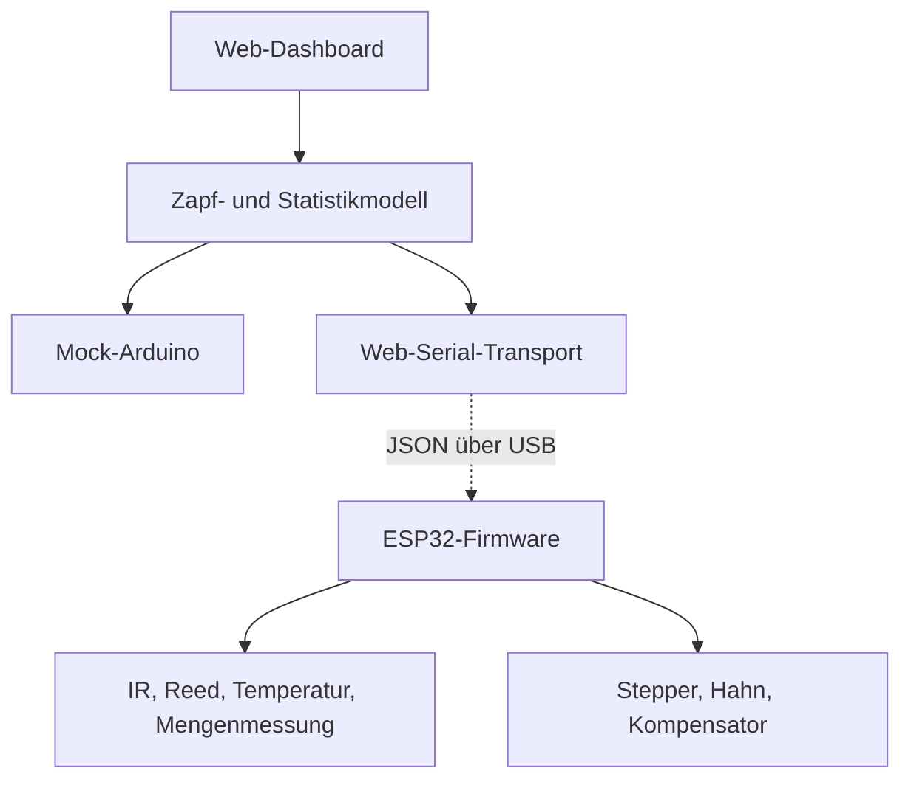

# Bestandsanalyse und Zielarchitektur

Grundlage dieser Beschreibung ist `Kai_Zapfanlage_V4_4.ino`.

## 1. Heutige Funktionalität

### Hardware und Ein-/Ausgänge

| Bereich | Umsetzung im Bestand |
|---|---|
| Steuerung | ESP32/Arduino-Umgebung |
| Anzeige | ST7735-TFT über SPI |
| E/A-Erweiterung | MCP23X17 über I²C |
| Vertikalschlitten | TMC5160-Schrittmotor, Endschalter und mechanische Entriegelung |
| Rondell | zweiter TMC5160-Schrittmotor, Nullstellung sowie zwei Reed-Signale |
| Bierhahn | Servo mit Vor-, Null- und Rückwärtsposition |
| Kompensator | Servo, abgeleitet aus dem Durchflusswert |
| Glaserkennung | analoger IR-Wert an `IRA` sowie Reed-Signale |
| Temperatur | DS18B20 |
| Bedienung | Hoch, Runter, Links, Rechts, Enter, Start und Not-Aus |
| Persistenz | fünf Einstellwerte im EEPROM |

### Einstellwerte

Die lokale TFT-Bedienung verändert Werte von 1 bis 10 und speichert sie direkt im EEPROM:

1. `Durchflussrate` – Stellung des Kompensatorservos
2. `schaumniveau` – Dauer der Rückwärtsstellung des Hahns
3. `fullhohe` – Hubweg während des Zapfens
4. `hochfahrGeschwindigkeit` – Schrittimpulsdauer beim Hochfahren
5. `anzapfzeit` – Wartezeit nach Öffnen des Hahns, multipliziert mit 300 ms

### Ablauf eines 6er-Zyklus

1. Der Starttaster setzt `zapfvorgangGestartet`.
2. `KranzPrufen()` fährt das Rondell bis zu 500 Schritte und sucht ein Reed-Signal.
3. Für die sechs Positionen wird der IR-Wert geprüft (`IRA >= 1500`).
4. Bei erkanntem Glas ruft die Steuerung `BierZapfen()` auf:
   - Kompensator einstellen
   - Schlitten entriegeln und absenken
   - bis zum Glasboden fahren
   - Hahn öffnen
   - Schlitten abhängig von Füllhöhe und Geschwindigkeit hochfahren
   - Hahn in die Schaumstellung fahren
   - Hahn schließen
   - Schlitten zum Endschalter zurückfahren
5. `Nachsteposition()` dreht das Rondell mit Anfahr- und Bremsrampe weiter.
6. Nach Position 6 wird das Rondell auf Null gestellt.

`Reed2` halbiert den Hubweg in `BierZapfen()` und bildet damit offenbar eine kleinere beziehungsweise halbhohe Glasvariante ab. Im Fasswechselmodus kann der Hahn über den Starttaster manuell geöffnet werden. Der Not-Aus schließt Hahn und Kompensator und referenziert beide Achsen.

## 2. Grenzen und technische Risiken im Bestand

| Thema | Auswirkung | Empfohlene Änderung |
|---|---|---|
| Keine Mengenmessung | Milliliter und Fassrest sind nicht bekannt | Durchfluss-, Glasgewichts- oder Fassgewichtssensor ergänzen |
| Viele blockierende Schleifen und `delay()` | Serielle Befehle und Statusabfragen könnten während eines Zyklus nicht reagieren | Nicht-blockierende Zustandsmaschine auf Basis von `millis()`/`micros()` |
| Umfangreiche Arbeit in `NotAus()` als Interrupt-Routine | Servo-, I²C- und Fahrfunktionen im Interrupt sind fehleranfällig | ISR setzt nur ein `volatile` Stopp-Flag; sichere Behandlung im Hauptzyklus |
| EEPROM-Werte ohne Gültigkeitsprüfung | Ein neues/gelöschtes EEPROM kann `255` liefern | Werteversion, Prüfsumme und Begrenzung auf gültige Bereiche |
| `Empfindlichkeit` nicht initialisiert | `GlasDa` wird aus einem nicht definierten Nutzwert berechnet | Initialwert speichern/lesen und Sensor kalibrieren |
| Vollerkennung deaktiviert | `IstGlasVoll()` beeinflusst den Ablauf aktuell nicht | Mit echter Messung in Zustandsmaschine integrieren |
| Positionsbezug nur durch Ablaufzählung | Schlupf oder manuelles Verdrehen kann Statistik verschieben | Nullfahrt vor Batch plus optional Positionsmagnete/Encoder |
| Seriell nur Debugausgabe | Keine strukturierte Kommunikation | Versioniertes Newline-JSON-Protokoll ergänzen |

Vor dem realen Umbau müssen Pinbelegung, aktive Pegel, mechanische Grenzwerte und das Verhalten bei Stromausfall an der Anlage verifiziert werden.

## 3. Webanwendung in dieser Ausbaustufe

Die GitHub Page bildet die bestehende Maschine als austauschbares Transportmodell ab:

Der Mock verwendet dieselben Zustände und Datensätze, die später von der Anlage gemeldet werden. Dadurch können UI, Historie, Auswertung und Einstellmasken heute getestet werden, ohne die produktive Firmware zu verändern.

## 4. Empfohlene Firmware-Erweiterung

### Zustandsmaschine

Der Ablauf sollte in klaren Zuständen laufen, beispielsweise:

`IDLE → HOMING → SCANNING → LOWERING → PRE_POUR → POURING → FOAMING → RAISING → ROTATING → COMPLETE`

Jeder Schleifendurchlauf verarbeitet Not-Aus, Serial-Eingang, Zeitlimits und Sensoren. Kein Zustand darf die CPU über lange `while`-Schleifen blockieren.

### Telemetrie

Der ESP32 sendet mindestens:

- Online-/Versionsstatus
- Maschinenzustand, Phase und aktive Position
- Glas erkannt/fehlt und Glasprofil
- Temperatur
- Start, Ende, Abbruch und Fehler eines Zapfvorgangs
- gemessene oder geschätzte Menge und Füllprozent
- aktuelle Einstellungen und Kalibrierversion
- Wartungszähler

### Befehle

Die Webseite benötigt:

- Zustand und Einstellungen lesen
- 6er-Zyklus starten
- sicher stoppen
- Einstellungen mit Wertebegrenzung schreiben
- Referenzfahrt und Wartungsmodus nur mit zusätzlicher Freigabe
- Kalibrierung starten/bestätigen

Details stehen in [SERIAL_PROTOCOL.md](SERIAL_PROTOCOL.md).

## 5. Daten- und Sicherheitskonzept

### Lokale Einzelanlage

Für einen Laptop direkt an der Zapfanlage genügt Web Serial. Die Seite läuft über HTTPS, der Benutzer wählt den USB-Port aktiv aus und die Daten bleiben im Browser. Das ist der einfachste und robusteste erste Schritt.

### Mehrere Geräte oder Fernzugriff

GitHub Pages besitzt keinen Server und keine sichere Benutzerverwaltung. Für zentrale Historie, echten Passwortschutz, mehrere Rollen oder Fernzugriff ist ein Backend nötig. Sinnvolle Bestandteile wären:

- Benutzeranmeldung mit Rollen Bediener/Admin
- Datenbank für Zapfungen, Einstellungen und Audit-Log
- HTTPS- oder MQTT-Gateway am Standort
- Geräteidentität mit rotierbaren Schlüsseln
- Offlinepuffer im ESP32 oder lokalen Gateway

Der ESP32 sollte niemals direkt ungeschützt aus dem Internet erreichbar sein.

## 6. Zusätzliche sinnvolle Funktionen

Nach Inbetriebnahme der Schnittstelle bieten sich folgende Erweiterungen an:

- Kalibrierassistent je Glasgröße mit mehreren Referenzfüllungen
- automatische Erkennung auffälliger Rondellpositionen
- Fasswechsel-Workflow mit Fass-ID, Sorte, Startmenge und Anstichzeit
- Schankverlust: Fassabgang gegen Summe der Glasmengen
- Temperatur- und Stillstandsalarm
- Reinigungsprotokoll mit Erinnerungen
- Wartungszähler für Motoren, Hahn und Dichtungen
- Export für Verbrauch, Veranstaltung oder Abrechnung
- Bedieneransicht mit großen Touch-Zielen und separater Serviceansicht
- manipulationssicheres Audit-Log für Parameteränderungen
